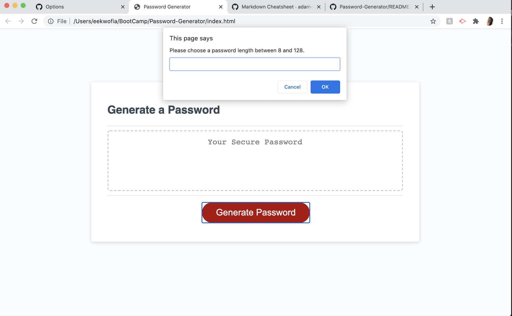

Alt- H1 Password-Generator

Alt-H2 Instructions
 Create an application that an employee can use to generate a random password based on criteria they’ve selected by modifying starter code. This app will run in the browser, the languages usedd will be ***HTML*** and ***CSS*** powered by ***JavaScript*** The ***HTML*** and ***CSS*** was provided, and I had to create a ***Javascript*** file. It will have a clean and polished user interface that is responsive, ensuring that it adapts to multiple screen sizes.

 The password will be generated based on the following criteria which will be selected by the user:
 * Password length between 8-128 character
 * Whether or not password should include upper case letters
 * Whether or not password should include lower case letters
 * Whether or not password should include numbers
 * Whether or not password should include special characters

 Alt-H2 How to Use Application
 1. User will click the "Generate Password" button.
2. User will enter the desired length of your password.
3. User will confirm whether or not they would like to include upper case letters.
4. User will confirm whether or not they would like to include lower case letters.
5. User will confirm whether or not they would like to include special characters.
6. User will confirm whether or not they would like to include numbers.

Your new password will be displayed in the text area for copy.

Alt-H2 Screenshot of Project

Alt-H3 Links to Project
1. https://github.com/itz-essie/Password-Generator.git
2. https://itz-essie.github.io/Password-Generator/

